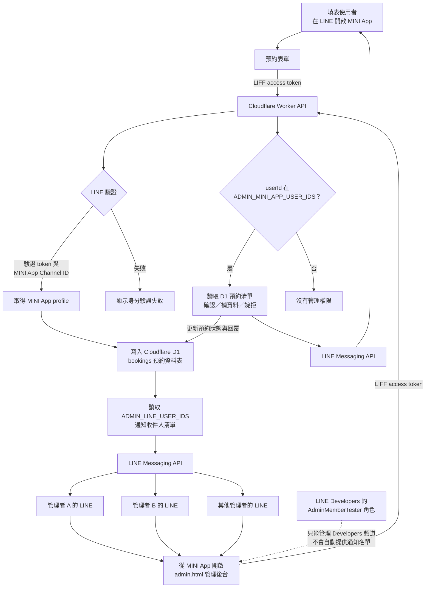

# LINE MINI App 技術說明

本專案使用原生 HTML、CSS、JavaScript 與 LINE LIFF SDK。前端透過 GitHub Actions 部署至 GitHub Pages；後端以 Cloudflare Workers 提供 JSON API，並透過 `DB` binding 存取 Cloudflare D1。

## 專案結構

```text
.
├── .github/workflows/deploy-pages.yml  # GitHub Pages 部署流程
├── index.html / app.js / styles.css   # 使用者介面
├── admin.html / admin.js / admin.css  # 管理介面
├── privacy.html / terms.html / legal.css
├── config.js                         # 前端使用的 Worker URL
└── worker/
    ├── src/index.js                  # API、LINE 驗證與推播
    ├── schema.sql                    # D1 資料表與索引初始化 SQL
    ├── wrangler.toml                 # Worker、D1 binding 與 CORS 設定
    ├── package.json                  # Worker 工具與執行指令
    └── pnpm-lock.yaml                # 依賴版本鎖定
```

前端沒有套件安裝或編譯步驟。套件管理使用 **pnpm**，指令於 `worker/` 執行。

## 現有設定

| 項目 | 設定位置與用途 |
| --- | --- |
| Worker | `worker/wrangler.toml`：名稱為 `syuanluo-booking-api`，入口為 `src/index.js` |
| D1 | 同檔已填入 `syuanluo-booking` 的 `database_id`，程式透過 `env.DB` 存取 |
| CORS | 同檔的 `ALLOWED_ORIGINS` 目前為 `https://illumyst.github.io` |
| API URL | `config.js` 已設定 HTTPS 的 `workers.dev` 網址 |
| LIFF ID | `app.js` 與 `admin.js` 各自設定 `LIFF_ID`，更換時需同步修改 |
| 前端部署 | `.github/workflows/deploy-pages.yml`，推送至 `main` 或手動觸發 |

以下部署流程以沿用既有 Cloudflare Worker、遠端 D1 與 secrets 為前提。

## Cloudflare Worker 部署

### 安裝工具與登入

從專案根目錄執行：

```bash
cd worker
pnpm install --frozen-lockfile
```

Node.js 請使用 22.12 以上版本：目前 lockfile 鎖定的 Wrangler 4.141.0 要求 Node.js 22 以上，oxlint 與 oxfmt 在 Node.js 22 系列則要求至少 22.12。

若本機尚未登入 Cloudflare，執行 `pnpm exec wrangler login`。以下指令都在 `worker/` 內執行。

### 更新既有 Worker

確認 `wrangler.toml` 的 D1 binding 與 CORS 設定後部署：

```bash
pnpm run deploy
```

此指令執行 `wrangler deploy`，只部署 Worker；不會初始化 D1 schema，也不會部署 GitHub Pages。日常程式更新不需要重建資料庫或重新設定未變更的 secrets。

`ALLOWED_ORIGINS` 可用逗號分隔多個來源。來源只包含協定、主機與必要的連接埠，不包含路徑或結尾斜線。例如 GitHub Pages 網址即使包含 repository 路徑，來源仍是 `https://illumyst.github.io`。修改後需重新部署 Worker。

若 Worker 網址改變，更新根目錄 `config.js` 的 `window.SYUANLUO_API_BASE_URL`（不含結尾斜線），再部署前端。

### Worker 環境變數

Worker 使用 Cloudflare 上的以下設定；日常部署沿用既有值：

| 名稱 | 用途 |
| --- | --- |
| `LINE_MINI_APP_CHANNEL_ID` | 比對 LINE token 所屬的 MINI App Channel；不是 LIFF ID |
| `LINE_MESSAGING_CHANNEL_ACCESS_TOKEN` | 呼叫 LINE Messaging API 的憑證 |
| `ADMIN_LINE_USER_IDS` | LINE 官方帳號推播通知的收件人清單；從 Messaging API 取得，以逗號分隔多個 ID |
| `ADMIN_MINI_APP_USER_IDS` | 管理後台權限清單；從 MINI App 成功送出的預約資料取得，以逗號分隔多個 ID |
| `ADMIN_LINE_USER_ID`、`ADMIN_MINI_APP_USER_ID` | 舊版單一管理者設定；保留相容性，完成轉換後可刪除 |

## GitHub Pages 部署

專案已有自訂 workflow，repository 的 **Settings → Pages → Build and deployment → Source** 應選擇 **GitHub Actions**，與現有流程搭配。[GitHub 官方設定說明](https://docs.github.com/en/pages/getting-started-with-github-pages/configuring-a-publishing-source-for-your-github-pages-site)

推送至 `main`，或在 Actions 手動執行 `Deploy static site to GitHub Pages`，會依序：

1. 取出 repository。
2. 將 workflow 明確列出的 HTML、CSS、JavaScript 複製到 `_site/`。
3. 上傳 Pages artifact 並部署。

流程不執行前端 build，也不發布 `worker/`。新增需要公開的靜態檔案時，需同步更新 workflow 的 `cp` 清單。

部署後，確認 `config.js` 指向正確的 Worker URL，且 Worker 的 `ALLOWED_ORIGINS` 包含網站來源。LINE Developers Console 的 MINI App Endpoint URL 則需指向完整的前端 HTTPS 網址，包含必要的 repository 路徑。

## API 與驗證

| 方法 | 路徑 | 驗證 | 用途 |
| --- | --- | --- | --- |
| `GET` | `/health` | 無 | 回傳 `{"ok":true}` |
| `POST` | `/bookings` | LINE access token | 新增資料 |
| `GET` | `/bookings` | 管理員 | 查詢資料，支援 `status`、`date` |
| `PATCH` | `/bookings/:id` | 管理員 | 更新資料 |
| `OPTIONS` | 所有路徑 | 無 | 回應 CORS 預檢請求 |

資料 API 使用 `Authorization: Bearer <LINE access token>`。Worker 向 LINE 驗證 token、比對 Channel ID，再取得 profile；管理 API 額外比對 `ADMIN_MINI_APP_USER_IDS`。CORS 只控制瀏覽器跨來源讀取，不能取代上述身分驗證。新預約會推播給 `ADMIN_LINE_USER_IDS` 中的所有收件人。

### 預約、管理與通知流程



兩份管理者名單的用途不同：`ADMIN_MINI_APP_USER_IDS` 控制誰能使用管理後台；`ADMIN_LINE_USER_IDS` 決定誰會收到新預約通知。LINE Developers 的角色名單不會自動成為 Messaging API 的推播收件人。

推播透過 `ctx.waitUntil()` 背景執行，失敗會記錄到 log；API 寫入成功不代表通知已送達。

## 檢查與維護

在 `worker/` 執行：

```bash
pnpm run lint
pnpm run format:check
```

以上只檢查 `worker/src`。需要自動格式化時使用 `pnpm run format`，會修改該目錄的程式碼。

可檢查目前設定的 Worker 健康端點：

```bash
curl https://syuanluo-booking-api.syuanluo-booking-api.workers.dev/health
```

預期回應為 `{"ok":true}`；此端點不查詢 D1，也不呼叫 LINE，因此不能用來確認資料庫、驗證或推播是否正常。

查看 Worker 即時記錄：

```bash
pnpm exec wrangler tail
```
